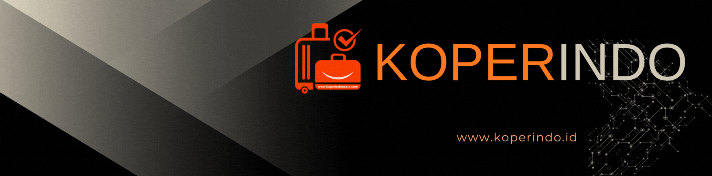

<!--Banner-->

    

 
    

🧳 **KOPERINDO** adalah perusahaan manufaktur koper terkemuka di Indonesia yang berdedikasi untuk menghadirkan produk berkualitas tinggi dengan desain inovatif untuk memenuhi kebutuhan perjalanan Anda.

Kami spesialis dalam:
- **Produksi Koper Berkualitas**: Memproduksi berbagai jenis koper dari hardcase, softcase, hingga cabin size dengan material premium.
- **Desain Inovatif**: Menghadirkan desain modern dan fungsional yang mengikuti tren global dengan sentuhan lokal.
- **Kontrol Kualitas Ketat**: Memastikan setiap produk melalui standar quality control yang tinggi untuk daya tahan maksimal.
- **Customization Services**: Menyediakan layanan kustomisasi untuk kebutuhan korporat, souvenir, dan pemesanan khusus.

## 💡 Misi Kami
Di **KOPERINDO**, kami berkomitmen untuk **menjadi mitra perjalanan terpercaya** dengan menghadirkan produk koper berkualitas yang tahan lama, stylish, dan terjangkau untuk semua kalangan.

## 📈 Visi Kami
1. **Menjadi Brand Lokal Terdepan**: Menjadikan KOPERINDO sebagai pilihan utama koper buatan Indonesia.
2. **Ekspansi Pasar Global**: Membawa produk Indonesia ke pasar internasional.
3. **Inovasi Berkelanjutan**: Terus berinovasi dalam desain, material, dan teknologi produksi.

## 🛠️ Apa yang Kami Tawarkan
- 🧳 **Hardcase Luggage** - Koper keras anti benturan
- 👜 **Softcase Luggage** - Koper fleksibel dan ringan
- ✈️ **Cabin Size** - Koper ukuran kabin untuk penerbangan
- 💼 **Business Travel Bags** - Tas perjalanan bisnis premium
- 🎨 **Custom Design** - Layanan kustomisasi logo dan desain
- 🔧 **After Sales Service** - Garansi dan layanan purna jual

## 🏭 Keunggulan Kami
✅ **100% Produksi Lokal Indonesia**  
✅ **Material Berkualitas Tinggi**  
✅ **Desain Modern & Ergonomis**  
✅ **Harga Kompetitif**  
✅ **Garansi Resmi**  
✅ **Ramah Lingkungan**  

## 🤝 Kerjasama & Distribusi
Kami terbuka untuk kerjasama dengan distributor, retailer, dan korporat di seluruh Indonesia. Mari bersama-sama menghadirkan produk koper berkualitas untuk pasar Indonesia dan mancanegara!

## 🌐 Hubungi Kami
- 🌍 [Website](https://koperindo.co.id)
- 📷 [Instagram](https://www.instagram.com/koperindo.official)
- 📘 [Facebook](https://www.facebook.com/koperindo)
- 🛒 [Tokopedia](https://tokopedia.com/koperindo)
- 🛍️ [Shopee](https://shopee.co.id/koperindo)
- 📧 Email: info@koperindo.co.id
- 📞 WhatsApp: +62 812-3456-7890

---

**Made with ❤️ in Indonesia**

Terima kasih telah mengunjungi **KOPERINDO**! Kami bangga menjadi bagian dari perjalanan Anda. Mari bersama-sama menjelajahi dunia dengan koper berkualitas buatan Indonesia! 🇮🇩✨

---

    
    
    

